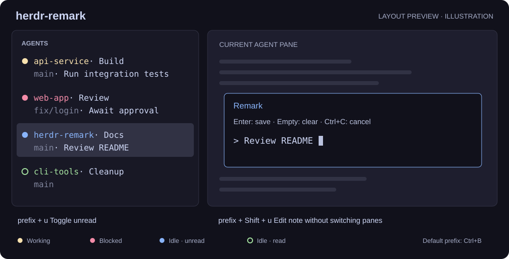

# herdr-remark

**English** | [简体中文](README.zh-CN.md)

Two shortcuts to mark Herdr agents read/unread and edit short notes, without leaving the current pane. No npm dependencies or build step.



*Layout illustration, not a screenshot.* First row: status light + directory · tab. Second row: Git branch · note; empty fields are hidden. The light and directory share a color; other fields are styled independently.

## Install

Requires **Herdr 0.8.2+, Node.js 18+ and Git** on `PATH`. Herdr 0.9.1+ is recommended for focus event fixes. Run inside a running Herdr session:

```sh
git clone https://github.com/huluhuluu/herdr-remark.git
cd herdr-remark
```

**Windows · PowerShell**

```powershell
powershell -NoProfile -ExecutionPolicy Bypass -File .\scripts\install.ps1
```

**Linux · Bash**

```bash
bash scripts/install.sh
```

The script backs up and validates the config, links the plugin, and configures the sidebar and shortcuts. **Keep this checkout after installation.** Add `--check` to validate only. If existing sidebar settings or shortcuts conflict, merge [config.example.toml](config.example.toml) manually, then run `herdr plugin link .` and the reload commands below.

## Use

Focus the target agent first. The default `prefix` is `Ctrl+B`: press and release it, then press the next key.

| Shortcut | Action |
| --- | --- |
| `prefix+u` | Toggle read / unread |
| `prefix+shift+u` | Edit a note in a small popup |

**Unread:** stays marked while you remain in the agent; leave and return to clear it, or toggle again. Working and blocked states take priority over unread.

| State | Light |
| --- | --- |
| Working | Yellow `●` |
| Blocked / awaiting input | Red `●` |
| Idle, read | Green `○` |
| Idle, unread / unseen background completion (`done`) | Blue `●` |
| Unknown | Gray `·` |

**Notes:** prefill the existing pane name → agent summary → conversation title. `Enter` saves, empty input + `Enter` clears, and `Ctrl+C` cancels. Notes are limited to 80 Unicode characters and saved as native pane names, replacing any existing custom name.

## Change shortcuts

Edit Herdr's **active `config.toml`**, usually `%APPDATA%\herdr\config.toml` on Windows or `~/.config/herdr/config.toml` on Linux. `HERDR_CONFIG_PATH` takes precedence, followed by `XDG_CONFIG_HOME/herdr/config.toml`.

Find the two existing bindings below (inside `# herdr-remark begin` / `end` for script installs). Change only their `key` values; for example, use `r` instead of `u`. **Replace the existing entries; do not append duplicates.** Choose unused keys.

```toml
[[keys.command]]
key = "prefix+r"
type = "plugin_action"
command = "huluhlu.agent-inform.toggle-unread"

[[keys.command]]
key = "prefix+shift+r"
type = "plugin_action"
command = "huluhlu.agent-inform.note"
```

Validate and apply your changes:

```sh
herdr config check
herdr server reload-config
```

For manual installation or a code update, also run `npm run init` from the checkout. Update with `git pull --ff-only`; rerunning the installer resets shortcuts and colors in its managed block to the example defaults.

## Notes

- Unread marks reset when the Herdr server restarts; notes persist through Herdr.
- Lights use static Catppuccin colors, without animation or automatic theme matching. Edit `fg` values in the sidebar config to customize them.
- Git branches refresh on focus and agent events. There is no background polling or native sidebar right-click menu.
- Windows has been tested; the Bash installer has been checked under Git Bash, but native Linux has not been tested.

Development: `npm test`; after manifest changes, run `herdr plugin link .` again.

[Changelog](CHANGELOG.md) · [Issues](https://github.com/huluhuluu/herdr-remark/issues) · [MIT License](LICENSE)
